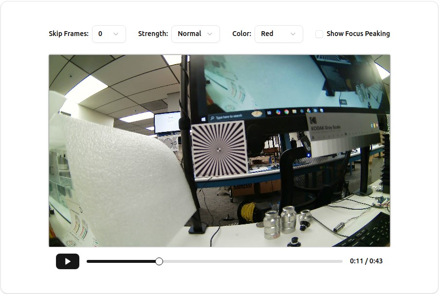

Approach:
I made a React App with the ShadCN UI component library to display Focus Peaking on the provided video. The majority of the work in done in the src/components/MediaPlayer.js component. It displays a Canvas object over the video, and uses a Sobel Filter to detect high contrast parts of the video and highlight them on the Canvas. I added a simple Play/Pause button and slider under the video because the default controls would be covered by the Canvas. In the case that the app is taking too much processing power, there is an option to Skip Frames to lower the processing load. The other options are to lower/raise the strength of the highlight, change the color, and toggle it On/Off. The run.sh calls the python script startApp.py, which uses a Python http.server to server the app and start it in the Chromium-Browser (if available), or the Default Browser.

Special Notes:
- I had some issues when testing it on a x86 Linux machine where the CSS styles weren't properly applied on older browsers. I had success running it on a chromium-browser which can be installed with the install.sh script.
- ./install.sh only installs the chromium-browser. Running it is optional unless the default browser doesn't apply the CSS styles correctly. The rest of the project is already built.
- When testing ./run.sh, it seemed to take a while to fully shut down the server, so I would receive [Address already in use] if rerunning ./run.sh too quickly.
- Can't run ./run.sh as root. Will get error [Running as root without --no-sandbox is not supported.]

Usage Instructions:
1. Copy build.tar to Linux machine
2. In directory with build.tar, run: tar -xvf build.tar
3. cd build
4. (Optional) Install Chromium-browser with sudo privileges: ./install.sh
5. Run App: ./run.sh

Screenshots:
Focus Peaking On:

Focus Peaking Off:

